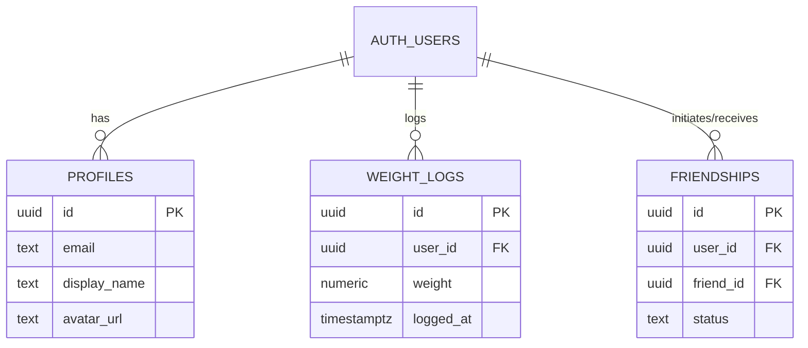

<div align="center">

# ⚡ IronGraph

**The Next-Generation Social Fitness & Weight Tracking Platform.**<br>
Built for performance, precision, and friendly competition with a cyberpunk neon aesthetic.

[](https://reactnative.dev/)
[](https://expo.dev/)
[](https://www.typescriptlang.org/)
[](https://supabase.com/)
[](https://expo.dev/eas)
[](https://opensource.org/licenses/MIT)

---

</div>

## 📖 Overview

**IronGraph** is a cutting-edge mobile fitness application designed to turn solo weight tracking into an engaging, socially driven experience. Featuring a pitch-black dark mode interface accented with high-contrast Neon Green (`#39FF14`) and Electric Blue (`#00FFFF`), IronGraph combines real-time personal analytics with competitive head-to-head friend timelines.

Whether you are logging daily weight changes, analyzing long-term trends, or competing with workout partners on the weekly delta leaderboard, IronGraph delivers state-of-the-art performance with zero UI lag.

---

## ✨ Key Features

### 📈 1. Advanced Weight Analytics & Charting
*   **Dynamic Time Horizons**: Switch seamlessly between **Daily**, **Weekly**, **Monthly**, and **Yearly** historical views.
*   **Smart Auto-Scaling Y-Axis**: Powered by `react-native-gifted-charts`, the graph automatically calculates minimum and maximum weight bounds, padding the viewport by ±5 kg so data lines never clip or squash against the screen edges.
*   **Real-Time Log Management**: Instant numeric input validation, interactive history logs, and one-tap record deletion with immediate UI reflection.

### 🥊 2. Social Hub & Competitive Leaderboards
*   **Global User Directory**: Discover and connect with fitness enthusiasts across the platform with real-time relational status badges (`Friends`, `Pending`, `Review`, `Add`).
*   **Two-Way Friend Request Engine**: Send, accept, or decline friend requests with full backend validation and duplicate-request protection.
*   **Weekly Delta Rankings**: Automatically aggregates and ranks your accepted friends by their 7-day weight change.
*   **Head-to-Head Comparison Chart**: A dual-timeline comparison chart plotting your progress against your `#1 Top Friend` in contrasting neon colors, sharing a unified dynamic scale.

### 🎨 3. Premium Cyberpunk Aesthetic & Customization
*   **High-Contrast Dark Mode**: Built with custom design tokens (`#0A0A0A` background, `#1A1A1A` cards, `#39FF14` primary accents) for maximum readability in gym environments.
*   **Custom Avatar Uploads**: Native camera roll integration via `expo-image-picker` allowing 1:1 photo cropping and direct uploading to secure cloud storage buckets.
*   **In-Line Username Editor**: Sleek display name customization (`✎ Edit`) reflecting instantly across leaderboards and social feeds.
*   **Rock-Solid Android & iOS Styling**: Uses strict ternary styling architectures to eliminate Android Pressable transparency bugs.

### 🔒 4. Enterprise-Grade Security & Isolation
*   **Multi-Account State Isolation**: Complete local cache and state wiping upon logout, ensuring zero data leakage when switching between user accounts on shared devices.
*   **Row Level Security (RLS)**: Strict PostgreSQL database policies ensuring users can only read, write, or modify their own private health data and avatars.
*   **Race-Condition Immune**: Built with proactive `isMounted` hook guards and component lifecycle safeguards to guarantee smooth transitions during rapid authentication shifts.

---

## 🛠️ Technology Stack

| Component | Technology | Description |
| :--- | :--- | :--- |
| **Framework** | [React Native](https://reactnative.dev/) & [Expo 52](https://expo.dev/) | Cross-platform native mobile development |
| **Language** | [TypeScript](https://www.typescriptlang.org/) | End-to-end type safety and developer productivity |
| **Routing** | [Expo Router](https://docs.expo.dev/router/introduction/) | File-based routing with seamless screen transitions |
| **Backend & DB**| [Supabase](https://supabase.com/) | PostgreSQL database, real-time subscriptions, & authentication |
| **Cloud Storage**| [Supabase Storage](https://supabase.com/docs/guides/storage) | Secure bucket hosting for user profile pictures |
| **Visualization**| [React Native Gifted Charts](https://github.com/Abhinandan-Kushwaha/react-native-gifted-charts) | High-performance, customizable 2D line & bar charts |
| **Build Tooling**| [EAS Build](https://docs.expo.dev/build/introduction/) | Cloud compilation for Android APK/AAB and iOS IPA |

---

## 🚀 Getting Started

Follow these steps to set up the project locally for development and testing.

### Prerequisites
*   [Node.js](https://nodejs.org/) (v18 or newer)
*   [Git](https://git-scm.com/)
*   [Expo CLI](https://docs.expo.dev/more/expo-cli/) (`npm install -g expo-cli`)
*   [Android Studio](https://developer.android.com/studio) (for Android emulator) or an iOS/Android physical device with **Expo Go / Dev Client**.
*   A free [Supabase](https://supabase.com/) account and project.

### 1. Clone the Repository
```bash
git clone https://github.com/Karthik1404-h/IronGraph.git
cd IronGraph
```

### 2. Install Dependencies
```bash
npm install
```

### 3. Configure Environment Variables
Create a `.env` file in the root directory and add your Supabase project credentials:
```env
EXPO_PUBLIC_SUPABASE_URL=https://your-project-id.supabase.co
EXPO_PUBLIC_SUPABASE_ANON_KEY=your-supabase-anon-public-key
```

### 4. Setup Supabase Database Schemas
Navigate to your Supabase Dashboard -> **SQL Editor**, paste and execute the following SQL scripts included in the repository root:
1.  **`supabase_storage_schema.sql`**: Initializes the `avatars` storage bucket and applies user-scoped RLS upload/delete policies.
2.  **Social & Weight Tables**: Ensure your PostgreSQL database has the required tables (`profiles`, `weight_logs`, and `friendships`) configured with RLS.

### 5. Start the Development Server
Since IronGraph utilizes native libraries (such as `expo-image-picker`), run the app using Expo Dev Client:
```bash
npx expo start --dev-client
```
Scan the generated QR code with your camera (iOS) or the Expo Go / Dev Client app (Android).

---

## 📦 Building Standalone Android APKs

Need to distribute an internal test build to your friends or beta testers without requiring Expo dev servers? You can compile a standalone Android APK using **EAS Build**:

1. Ensure you have the EAS CLI installed and logged in:
   ```bash
   npm install -g eas-cli
   eas login
   ```
2. Trigger an internal APK build using our pre-configured `preview` profile:
   ```bash
   eas build --profile preview -p android
   ```
3. Once the cloud build completes, download the `.apk` directly from your terminal link or Expo dashboard and install it on any Android device!

---

## 🗄️ Database Architecture

IronGraph relies on a clean, relational PostgreSQL schema managed via Supabase:



*   **`profiles`**: Synchronized automatically with Supabase Auth users. Stores display names and CDN links to uploaded avatars.
*   **`weight_logs`**: Time-series log of all user weight entries. Indexed by `user_id` and `logged_at` for rapid chart aggregation.
*   **`friendships`**: Manages social connections with stateful transitions (`pending` ➔ `accepted` or `declined`).

---

## 🗺️ Roadmap & Future Milestones

- [x] **Phase 1**: Core Authentication & Row Level Security (RLS)
- [x] **Phase 2**: Real-Time Weight Logger & Dynamic Gifted Charts
- [x] **Phase 3**: Global User Directory & Friend Request System
- [x] **Phase 4**: Weekly Delta Leaderboard & Dual-Timeline Head-to-Head Comparison
- [x] **Phase 5**: Camera Roll Avatar Uploads & Custom Username Engine
- [ ] **Phase 6**: Dashboard Workout Logging (Sets, Reps & Exercise Library)
- [ ] **Phase 7**: Active Training Streaks & Gym Gamification Badges
- [ ] **Phase 8**: Push Notifications for Friend Requests & Workout Reminders

---

## 🤝 Contributing

Contributions, issues, and feature requests are welcome! 
1. Fork the Project
2. Create your Feature Branch (`git checkout -b feature/AmazingFeature`)
3. Commit your Changes (`git commit -m 'Add some AmazingFeature'`)
4. Push to the Branch (`git push origin feature/AmazingFeature`)
5. Open a Pull Request

---

## 📄 License

Distributed under the **MIT License**. See `LICENSE` for more information.

---

<div align="center">
  <b>Built with 💪 by <a href="https://github.com/Karthik1404-h">Guru Karthikeya</a> and <a href="https://github.com/LOHITH5506H">Lohith</a></b>
</div>
